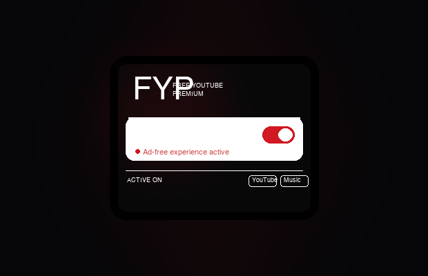

<div align="center">
  
  <h1>FYP — Free YouTube Premium</h1>
  <p>A lightweight Chrome extension that automatically skips and removes ads on YouTube and YouTube Music.</p>
</div>

---

## What it does

- **Skips skippable ads** instantly by clicking the skip button the moment it appears
- **Fast-forwards non-skippable ads** — mutes and jumps to the end in under a second
- **Dismisses overlay & banner ads** on the page
- Works on both **youtube.com** and **music.youtube.com**
- Simple on/off toggle — your preference is saved across sessions

## UI

<div align="center">
  
</div>

---

## Install manually (no Chrome Web Store needed)

> Takes about 60 seconds.

### Step 1 — Download the files

Click **Code → Download ZIP** on this page, then unzip it anywhere on your computer.

&nbsp;&nbsp;&nbsp;&nbsp;*Or clone it:*
```bash
git clone https://github.com/aivsomkar/FYP.git
```

### Step 2 — Open Chrome Extensions

Open a new tab and go to:
```
chrome://extensions
```

### Step 3 — Enable Developer Mode

Toggle **Developer mode** on in the top-right corner of the page.


### Step 4 — Load the extension

Click **Load unpacked**, then select the folder you unzipped (the one containing `manifest.json`).

### Step 5 — Done

The **FYP** icon will appear in your Chrome toolbar. Click it to toggle ad blocking on or off.

---

## Files

| File | Purpose |
|------|---------|
| `manifest.json` | Extension config & permissions |
| `content.js` | Ad-skip logic injected into YouTube pages |
| `popup.html / popup.js` | Toolbar popup UI |
| `icon*.png` | Extension icons (16, 48, 128px) |

---

<div align="center">
  <sub>Not affiliated with YouTube or Google. For personal use only.</sub>
</div>
