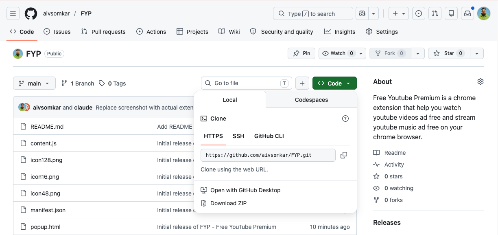
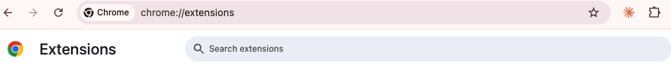
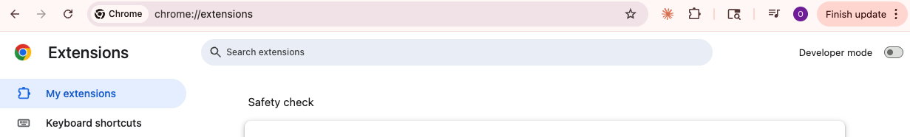
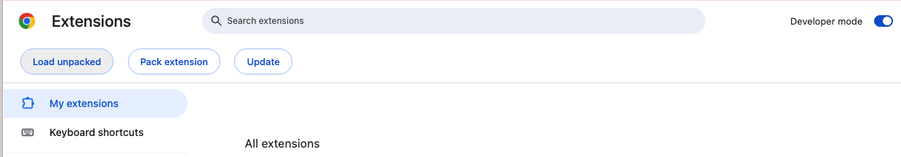
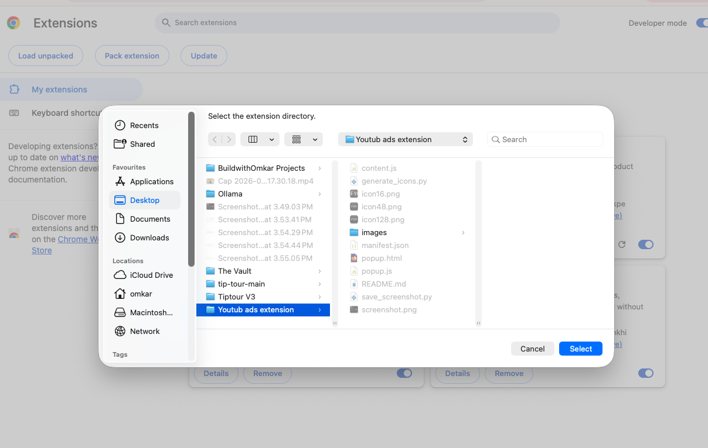
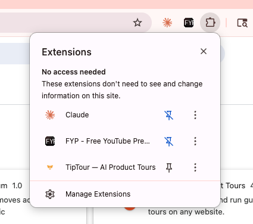
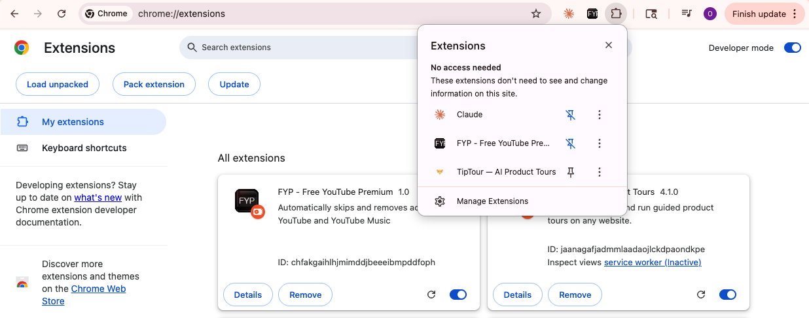

<div align="center">
  
  <h1>FYP — Free YouTube Premium</h1>
  <p>A lightweight Chrome extension that automatically skips and removes ads on YouTube and YouTube Music.</p>
</div>

---

## What it does

- **Skips skippable ads** instantly by clicking the skip button the moment it appears
- **Fast-forwards non-skippable ads** — mutes and jumps to the end in under a second
- **Dismisses overlay & banner ads** on the page
- Works on both **youtube.com** and **music.youtube.com**
- Simple on/off toggle — your preference is saved across sessions

## UI

<div align="center">
  
</div>

---

## Install manually (No Chrome Web Store needed)

> **No sign-up. No store approval. Takes about 2 minutes.**

---

### Step 1 — Download the extension files

Go to the top of this page and click the green **Code** button, then click **Download ZIP**.

<!-- SCREENSHOT: Green "Code" button dropdown on GitHub showing "Download ZIP" option -->


Once downloaded, **unzip** the file. You'll get a folder called `FYP-main` — remember where you saved it.

---

### Step 2 — Open Chrome's Extensions page

Open Google Chrome and type the following into the address bar, then press **Enter**:

```
chrome://extensions
```

<!-- SCREENSHOT: Chrome address bar with chrome://extensions typed in -->


---

### Step 3 — Turn on Developer Mode

In the **top-right corner** of the Extensions page, you'll see a toggle labelled **Developer mode**. Click it to turn it **ON**. The page will refresh and show extra buttons at the top.

<!-- SCREENSHOT: Extensions page with Developer Mode toggle highlighted in top-right corner -->


---

### Step 4 — Click "Load unpacked"

After enabling Developer Mode, a button labelled **Load unpacked** will appear in the top-left. Click it.

<!-- SCREENSHOT: "Load unpacked" button visible after enabling developer mode -->


---

### Step 5 — Select the FYP folder

A file picker will open. Navigate to the folder you unzipped in Step 1 (`FYP-main`). Select the **entire folder** (not an individual file inside it) and click **Open** / **Select Folder**.

> ⚠️ Make sure you select the folder that contains the `manifest.json` file directly inside it — not a parent folder.

<!-- SCREENSHOT: File picker showing the FYP-main folder selected -->


---

### Step 6 — Extension is installed

The **FYP** card will appear on the Extensions page, showing it's active.

<!-- SCREENSHOT: FYP extension card on chrome://extensions page -->


---

### Step 7 — Pin the extension to your toolbar

Click the **puzzle piece icon** (🧩) in the top-right of Chrome, find **FYP — Free YouTube Premium** in the list, and click the **pin icon** to pin it to your toolbar.

<!-- SCREENSHOT: Chrome extensions dropdown with pin icon next to FYP -->


---

### Step 8 — You're all set!

The **FYP icon** will now appear in your Chrome toolbar. Click it to open the toggle.

Head to [youtube.com](https://youtube.com) or [music.youtube.com](https://music.youtube.com) and play any video — ads will be skipped automatically.

<div align="center">
  
</div>

---

## Updating the extension

When a new version is released:
1. Download the new ZIP and unzip it (overwrite the old folder)
2. Go to `chrome://extensions`
3. Find FYP and click the **refresh icon** on its card

---

## Files

| File | Purpose |
|------|---------|
| `manifest.json` | Extension config & permissions |
| `content.js` | Ad-skip logic injected into YouTube pages |
| `popup.html / popup.js` | Toolbar popup UI |
| `icon*.png` | Extension icons (16, 48, 128px) |

---

<div align="center">
  <sub>Not affiliated with YouTube or Google. For personal use only.</sub>
</div>
